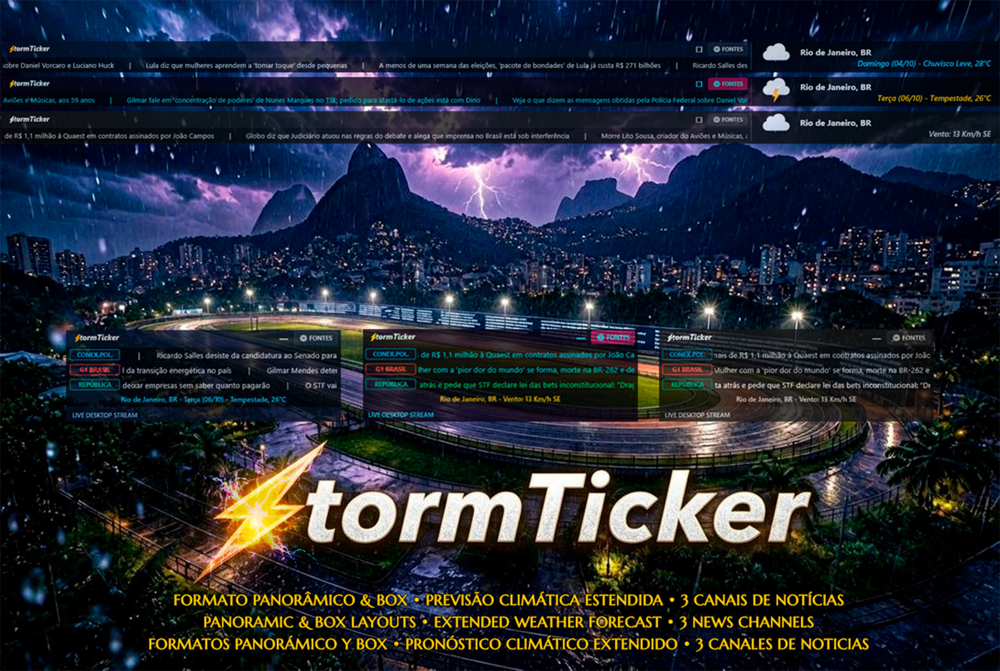

# ⚡ StormTicker — Asynchronous Desktop News Matrix & Weather Suite

  

> **A high-performance, asynchronous news ticker matrix and weather suite for Rainmeter.**  
> Featuring hardware-accelerated DirectWrite text streaming, dual display form factors (Panoramic Ribbon & Desktop Box), live Open-Meteo meteorological telemetry with 3-day forecast rotation, zero-editor visual feed management, full trilingual localization (English default, Portuguese, Spanish), and interactive headline scrubbing.

---

## ⚡ Upgrade to StormTicker Pro (10 Channels)

Want to run up to **10 completely independent channels simultaneously** with full desktop matrix coverage, multi-city 3D weather art, and a 100% ad-free experience?

👉 **[Unlock StormTicker Pro on DeviantArt](https://www.deviantart.com/geovanesou/art/1381771713)**

| Feature | StormTicker (Standard) | StormTicker Pro |
|---|:---:|:---:|
| **Concurrent News Lines** | 3 Channels | **10 Channels** |
| **Stream Experience** | Includes Promo Row | **100% Clean / Ad-Free** |
| **Form Factors** | Panoramic & Box | **Panoramic & Box** |
| **Visual Themes** | 3 Themes | **6 Hand-Crafted Themes** |
| **Weather Engine** | Open-Meteo Live + 3-Day Forecast | **3D WeatherArt + 3 Locations + Moon Lunation + AQI** |
| **Direct Portal Navigation** | ✅ Included | ✅ Included |
| **DirectWrite Hardware Acceleration** | ✅ 60 FPS | ✅ 60 FPS |
| **Smart Hover Freeze & Mouse Scrubbing** | ✅ Included | ✅ Included |
| **Individual Speed Tuning per Row** | ✅ 0.5x to 1.5x (3 Rows) | **✅ 0.5x to 1.5x (All 10 Rows)** |
| **Custom Refresh Intervals (15m to 6h)** | ✅ Full Selector | ✅ Full Selector |
| **Settings GUI Configuration** | Tabs 1–3 Unlocked | **All 10 Tabs Unlocked** |
| **Lifetime Updates & Priority Support** | Community | **VIP / Pro Support** |

---

## 📖 Overview

**StormTicker** is an original, ground-up desktop information suite engineered for traders, developers, and news enthusiasts who want continuous, real-time market and news feeds without cluttering their workspace.

Running silky-smooth, asynchronous news lines powered by Lua and DirectWrite, StormTicker streams real-time RSS/Atom headlines at a high frame rate (50–60 FPS) with a sub-1% CPU footprint.

---

## 🌟 Key Features

### 🚀 Asynchronous DirectWrite Matrix
- **True Multi-Stream Concurrency:** 3 independent news channels operating on separate speed factors (0.5x to 1.5x), producing a non-repetitive visual rhythm across your desktop.
- **Hardware-Accelerated Container Clipping:** Every channel is confined within dedicated DirectWrite shape containers for tear-free rendering.
- **Direct Portal & Article Dispatch:** Clicking on any channel badge opens the publication's root homepage; clicking on any headline opens that exact article in your browser.
- **Seamless Infinite Loop:** Proprietary Lua wrap-around logic seamlessly recycles headlines when the end of a batch is reached without stutter or visual jumps.
- **Dynamic Auto-Height:** The widget dynamically resizes its height to fit only active rows, cleanly stacking lines with zero wasted space.

### 📺 Dual Display Form Factors
- **Panoramic Ribbon (`Panoramic\*.ini`):** Full-width, single-line ticker designed for top-screen docking. Features continuous multi-channel streaming, split-flap airport transition for weather telemetry, and interactive cursor click-to-open article dispatch (`OpenPanLink`) with auto-resume timeout protection.
- **Modular Desktop Box (`Box\*.ini`):** Compact, self-contained desktop widget displaying 3 synchronized headline rows alongside an integrated meteorological HUD strip.

### 🌦️ Integrated Meteorological HUD (Open-Meteo)
- **Live Weather Telemetry:** Real-time temperature, condition status, and wind speed/direction.
- **3-Day Forecast Rotation:** Cyclical rotation showcasing upcoming forecasts (Tomorrow, Day+2, Day+3) with high-quality Meteocons vector icons.
- **Zero API Keys Required:** Seamlessly connects to Open-Meteo out-of-the-box. Coordinates and units can be customized directly in Settings.

### 🎨 3 Hand-Crafted Visual Themes
Switch themes instantly with a single click or through the context menu:
- ⚡ **StormTicker:** Classic carbon black background with signature electric green badges and crisp typography.
- 🌆 **Cyberpunk:** Neon cyan badges and vivid magenta accents for modern dark terminal setups.
- 🥈 **Stealth:** Minimalist titanium monochrome with muted grayscale accents.

### 🌐 Trilingual Localization Engine (i18n)
- **Native Runtime Localization:** Full support for **English** (default), **Portuguese** (`pt-BR`), and **Spanish** (`es-ES`) across all UI elements, weather conditions, dialogs, and settings tabs.
- **`SafeUpper` Latin Normalization:** Custom Lua capitalization engine preserving accented characters (`CÉU LIMPO`, `PANCADAS`, `CONDIÇÃO`) without Windows-1252 corruption.
- **First-Run Onboarding Wizard:** Automatically opens the Settings Manager upon first installation, welcoming users in English.
- **Right-Click Context Menu:** Direct access to `⚙️ Settings / Configuration` from anywhere on the skin background.

### 🎛️ Visual Feed & Settings Manager
- **Tabbed Settings GUI (`Settings.ini`):** Graphical control center with dedicated tabs for Channels 1–3, Weather Settings, Font selection, and Update Intervals.
- **Native Edit Dialogs:** Click any Tag or URL box to edit feeds directly in a standard Windows input box — zero text editor editing required.

### 🧠 Smart Hover & Interactivity
- **Selective Row Freeze:** Hovering over any channel pauses only that specific row, while other channels continue scrolling uninterrupted.
- **Interactive Mouse Scroll Scrubbing:** Roll the mouse wheel over any hovered channel to scrub forward or backward through headlines at your own pace.
- **Extrapolated Multi-Line Tooltips:** Expanded 620px viewport with intelligent text wrapping prevents headline truncation.

---

## 📦 Installation & Quick Start

1. Ensure **[Rainmeter 4.5+](https://www.rainmeter.net/)** (or higher) is installed on Windows 10 or 11.
2. Download the official **[`StormTicker_1.2.0.rmskin`](https://github.com/Geovanesou/StormTicker/releases/download/v1.2.0/StormTicker_1.2.0.rmskin)** package from the [Releases](https://github.com/Geovanesou/StormTicker/releases) page.
3. Double-click the `.rmskin` file and follow the standard Rainmeter installation prompt.
4. On first load, the **First-Run Setup Wizard** will launch automatically to welcome you and open the Settings Manager.
5. In the **Rainmeter Manage** window, select your preferred layout and theme:
   - **Desktop Box Card:** `StormTicker > Box > Box StormTicker.ini` *(or Cyberpunk, Stealth)*
   - **Panoramic Ribbon:** `StormTicker > Panoramic > Panoramic StormTicker.ini` *(or Cyberpunk, Stealth)*
6. Right-click anywhere on the skin and select **⚙️ Settings / Configuration** (or click the header gear button) to configure your RSS feeds, weather coordinates, and preferred language.

---

## 🗺️ Release History

### 🌟 Version 1.2.0
- **English Default & First-Run Wizard:** English set as default out-of-the-box language, with an automated onboarding wizard opening Settings on first boot.
- **100% Internationalized Settings:** Replaced all hardcoded Portuguese strings across Settings with dynamic `#Lang_*#` localization variables in English, Portuguese, and Spanish.
- **Interactive Panoramic Click-to-Open:** Clicking on headlines in Panoramic mode now resolves the underlying article and opens it directly in the default browser (`OpenPanLink`).
- **`SafeUpper` Latin Engine:** Enhanced uppercase transformation ensuring accented characters in Portuguese and Spanish headlines render cleanly without encoding defects.
- **Persistent Settings Navigation:** Active tab state is preserved across reloads and feed edit operations.
- **Right-Click Settings Integration:** Direct access to `⚙️ Settings / Configuration` from the context menu of all Box and Panoramic themes.

### 🌟 Version 1.1.0
- **Dual Form Factor Architecture:** Introduction of Panoramic Ribbon and Desktop Box layouts.
- **Extended Weather Engine:** 3-day forecast rotation powered by Open-Meteo.
- **Trilingual Localization:** English, Portuguese, and Spanish language catalogs.
- **Modernized Settings GUI:** Tabbed interface with visual feed controls.

### 🌟 Version 1.0.0
- Initial release featuring 3-channel asynchronous DirectWrite news streaming.

---

## 📄 License & Attribution

Copyright (c) 2026 **Geovane Souza** ([@Geovanesou](https://github.com/Geovanesou)). All Rights Reserved.  
Distributed under the [Proprietary Software License](LICENSE) for personal desktop customization.
